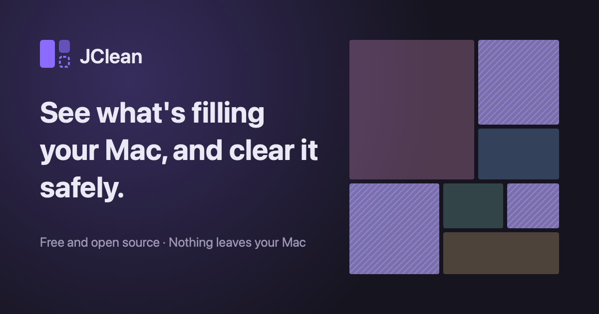

<div align="center">


# JClean

**See what's filling your computer, and clear it safely.**

A free, open-source storage cleaner for macOS, Windows and Linux. It finds the space you didn't know you were using (developer caches, old build folders, app leftovers, old installers, logs), explains each item in plain language, and lets you decide what goes.

No account. No tracking. Nothing leaves your computer.

[Download](#download) · [Safety](#how-jclean-keeps-your-files-safe) · [What it finds](#what-it-finds) · [Build from source](#build-from-source) · [Contributing](CONTRIBUTING.md)



</div>

## Download

| System               | Download                                                                                                                 | Requirements                              |
| -------------------- | ------------------------------------------------------------------------------------------------------------------------ | ----------------------------------------- |
| **Mac**              | [JClean_macos_universal.dmg](https://github.com/Joeboy77/JClean/releases/latest/download/JClean_macos_universal.dmg)     | macOS 12 or later, Apple Silicon or Intel |
| **Windows**          | [JClean_windows_x64_setup.exe](https://github.com/Joeboy77/JClean/releases/latest/download/JClean_windows_x64_setup.exe) | Windows 10 or 11, 64-bit                  |
| **Linux (.deb)**     | [JClean_linux_amd64.deb](https://github.com/Joeboy77/JClean/releases/latest/download/JClean_linux_amd64.deb)             | Ubuntu 22.04, Debian 12, Mint and newer   |
| **Linux (AppImage)** | [JClean_linux_x86_64.AppImage](https://github.com/Joeboy77/JClean/releases/latest/download/JClean_linux_x86_64.AppImage) | Most 64-bit distributions                 |

Every release lists SHA-256 checksums in `SHA256SUMS.txt`. JClean updates itself from **Settings → Updates**; each update is signed and checked before it installs.

<details>
<summary><strong>Opening JClean the first time</strong></summary>

JClean isn't notarized by Apple or code-signed for Windows yet, so each system asks you to confirm once.

**Mac**

1. Open the DMG and drag **JClean** into **Applications**.
2. Open JClean. macOS says it can't verify the app. Click **Done** (not "Move to Trash").
3. Open **System Settings → Privacy & Security**, scroll to _"JClean" was blocked to protect your Mac_, and click **Open Anyway**.

**Windows**

If SmartScreen says it _protected your PC_, click **More info**, then **Run anyway**. The installer puts JClean in your account only, so it doesn't need an administrator.

**Linux**

```sh
# Ubuntu, Debian, Mint
sudo apt install ./JClean_linux_amd64.deb

# Any distribution
chmod +x JClean_linux_x86_64.AppImage
./JClean_linux_x86_64.AppImage   # Ubuntu 22.04+ needs FUSE 2: sudo apt install libfuse2t64
```

</details>

## What it does

- **Scans in seconds.** A quick scan checks every place storage hides. A full scan maps your whole home folder.
- **Shows it as a map.** Every folder is a block sized by the space it takes, so the biggest things are obvious at a glance.
- **Explains everything.** Each item says what it is and what happens if it's cleaned, in plain words.
- **Sorts by risk.** Items are grouped as _Safe to clean_, _Needs review_, _Caution_ or _For your information_. Only safe, unused items are ever ticked for you.
- **Uses each tool's own cleanup** where one exists (`docker builder prune`, `npm cache clean`, `apt-get clean`, `dnf clean`…), so the tool stays consistent.
- **Two modes.** _Everyday_ uses simple categories; _Developer_ shows every cache by name.
- **Logs every clean** on your computer, with a history you can export.

## What it finds

About 70–80 kinds of storage on each system, all defined as data in [`rules/`](rules), so the list is easy to read and extend.

|                           | Mac                                                                                                                       | Windows                                                                                                                    | Linux                                                                                                     |
| ------------------------- | ------------------------------------------------------------------------------------------------------------------------- | -------------------------------------------------------------------------------------------------------------------------- | --------------------------------------------------------------------------------------------------------- |
| **Developer caches**      | npm, Yarn, pnpm, Bun, pip, uv, Poetry, Conda, Cargo, Go, Gradle, Maven, CocoaPods, Homebrew, Docker, Hugging Face, Ollama | npm, Yarn, pnpm, pip, uv, Cargo, Go, Gradle, Maven, NuGet, Docker, Hugging Face                                            | npm, Yarn, pnpm, pip, uv, Cargo, Go, Gradle, Maven, Homebrew, Docker, Hugging Face                        |
| **Project build folders** | `node_modules`, `target`, `.next`, `.venv`, `build`, `bin`/`obj`… in projects you haven't touched in months               | same                                                                                                                       | same                                                                                                      |
| **IDEs and SDKs**         | Xcode DerivedData, simulators, device support, old JetBrains versions, old editor extensions, Android emulators           | Visual Studio's installer cache, old JetBrains versions, Android emulators                                                 | old JetBrains versions, Android emulators                                                                 |
| **Apps and browsers**     | app caches, Chrome, Safari, Edge, Firefox, Brave, Arc, Slack, Discord, Teams                                              | Chrome, Edge, Firefox, Brave, Slack, Discord, Teams                                                                        | `~/.cache`, Chrome, Chromium, Edge, Firefox, Brave, Slack, Discord, Flatpak and Snap app caches           |
| **System**                | logs, crash reports, Time Machine local snapshots, the Trash                                                              | Temp, crash dumps, the Recycle Bin, Windows Update downloads, Delivery Optimization, old component versions, `Windows.old` | APT/DNF package caches, the systemd journal, old Snap versions, data from removed Flatpak apps, the Trash |
| **Your files**            | old installers in Downloads, large files you haven't opened in months, iPhone backups                                     | old installers, large files, iPhone backups                                                                                | old installers, large files                                                                               |

The full, current list, with what each item is and what cleaning it does, is generated from the same rule files on the website's _What it finds_ page.

## How JClean keeps your files safe

A storage cleaner deletes files, so one bug could destroy someone's work. JClean is built so that it can't.

- **It never reads your files.** Scanning uses names, sizes and dates only. It never opens a file's contents, and never downloads iCloud or OneDrive files that are only in the cloud.
- **Every item is checked again right before it's cleaned** by one guard that can't be turned off. It must sit inside a folder its rule is allowed to clean, and it can't be a protected location (your Documents, Desktop, Photos, SSH keys, keychains, Git repositories, the system). Anything that changed since the scan, or that an open app is using, is skipped.
- **It never follows links.** Symlinks and Windows junctions are removed as links, never followed out of the folder being cleaned.
- **When in doubt, it asks.** Anything that isn't clearly regenerable needs your review. User files go to the Trash or Recycle Bin, never deleted outright. _Caution_ items ask a second time and spell out what you'd lose.
- **Administrator tasks are minimal.** System items ask for approval once per clean (a password prompt, UAC, or polkit), and can only run an exact, built-in list of commands.
- **You can mark anything to keep.** Put a file named `.jclean-keep` in a folder, and JClean leaves it and everything inside it alone.
- **Every clean is logged** locally, and every clean can be previewed as a dry run first.

All deletion goes through a single function, `cleaner::execute`, and a test fails the build if anything else in the codebase tries to delete a file.

## Privacy

JClean has no account system and no analytics. It doesn't upload anything, and the only network request it makes is checking GitHub Releases for updates, which you can turn off in Settings.

## Build from source

You'll need:

- [Rust](https://rustup.rs) (stable)
- [Node.js](https://nodejs.org) 20.19 or later, and [pnpm](https://pnpm.io) 9 (`corepack enable` sets it up)
- The [Tauri prerequisites](https://tauri.app/start/prerequisites/) for your system. On Linux that's:

  ```sh
  sudo apt install libwebkit2gtk-4.1-dev libayatana-appindicator3-dev librsvg2-dev libxdo-dev libssl-dev
  ```

Then:

```sh
git clone https://github.com/Joeboy77/JClean.git
cd JClean
pnpm install

cd apps/desktop
pnpm tauri dev      # run the app
pnpm tauri build    # build an installer for this system
```

### Try it without touching your real files

The command-line harness scans exactly what the app does, and can build a fake home folder to clean safely:

```sh
cargo run -p jclean-cli -- scan --mode quick          # read-only scan of your home
cargo run -p jclean-cli -- fixture /tmp/jc            # build a demo home with one of everything
JCLEAN_DEV_ROOT=/tmp/jc pnpm tauri dev                # run the app against it (from apps/desktop)
```

### Checks

```sh
pnpm lint && pnpm typecheck && pnpm test
cargo clippy --all-targets -- -D warnings && cargo fmt --check
cargo test --workspace
```

CI runs these on macOS, Windows and Linux for every push.

## How it's built

| Part      | Technology                                    |
| --------- | --------------------------------------------- |
| App shell | [Tauri 2](https://tauri.app)                  |
| Engine    | Rust, in its own crate with no UI dependency  |
| Interface | React 19, TypeScript, Tailwind CSS 4, Motion  |
| Disk map  | `d3-hierarchy` for the layout, drawn by React |
| History   | SQLite                                        |
| Website   | Astro, on Cloudflare Pages                    |

```
crates/jclean-core     scanner, sizing, rules engine, SafetyGuard, cleaner (no UI dependency)
crates/jclean-cli      command-line harness for the engine
apps/desktop           the app: React frontend (src) and Tauri shell (src-tauri)
apps/web               the download website
packages/treemap       the disk map, shared by the app and the website
packages/design        colours, type and fonts, shared by the app and the website
rules/<os>/*.json      what JClean detects, as data
docs/SPEC.md           the full product and technical spec
```

## Contributing

Contributions are welcome, especially new rules for caches JClean doesn't know yet. A rule is a small JSON file, and most don't need any Rust. See [CONTRIBUTING.md](CONTRIBUTING.md) to get started.

Found something JClean shouldn't have offered to clean? Please [open an issue](https://github.com/Joeboy77/JClean/issues) right away. Safety bugs are always the top priority.

## License

[MIT](LICENSE). The bundled fonts, Instrument Sans and JetBrains Mono, are under the [SIL Open Font License](packages/design/fonts).
